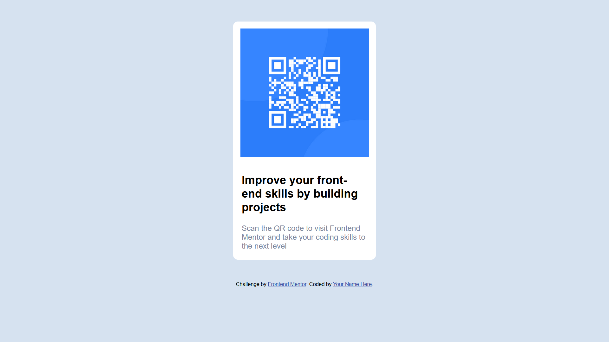

# Frontend Mentor - QR code component solution

This is a solution to the [QR code component challenge on Frontend Mentor](https://www.frontendmentor.io/challenges/qr-code-component-iux_sIO_H). Frontend Mentor challenges help you improve your coding skills by building realistic projects. 

## Table of contents

- [Overview](#overview)
  - [Screenshot](#screenshot)
  - [Links](#links)
- [My process](#my-process)
  - [Built with](#built-with)
  
- [Author](#author)
<!-- - [Acknowledgments](#acknowledgments) -->

## Overview

### Screenshot

### Links

-  [Solution URL](https://your-solution-url.com)
-  [Live Site URL](https://qr-component-main.vercel.app/)

## My process

### Built with

- Semantic HTML5 markup
- CSS custom properties
- Flexbox
- Mobile first 

## Author

- Website - [Jitesh117](https://www.your-site.com)
- Frontend Mentor - [@jitesh117](https://www.frontendmentor.io/profile/jitesh117)
- Twitter - [@jitesh_117](https://www.twitter.com/jitesh_117)

